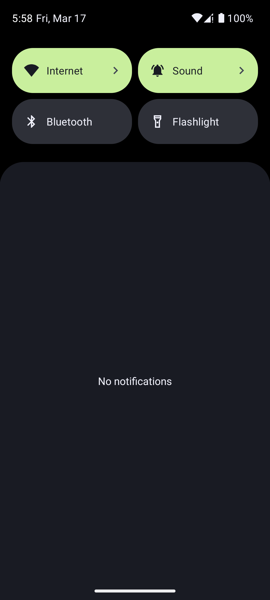
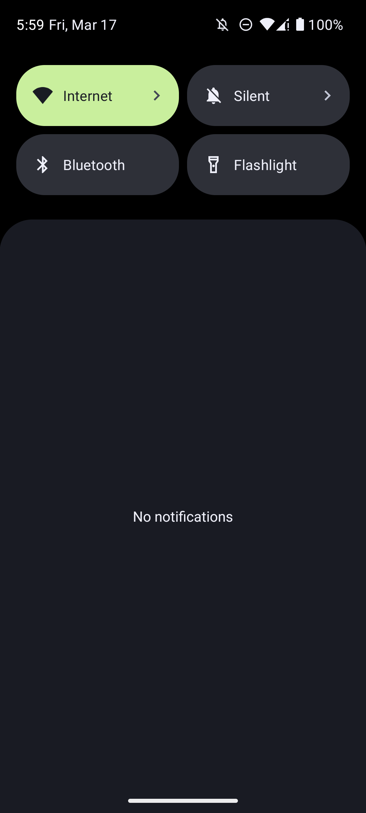
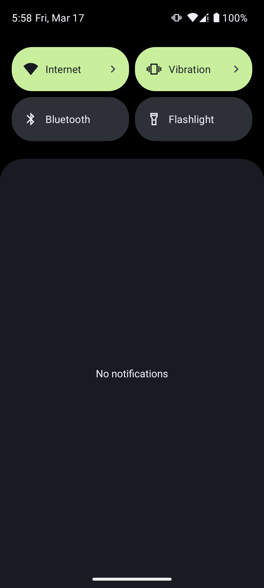

# sound-quick-settings

  
  
  

This app adds a simple quick setting that controls which mode the phone is on, ring, silent or vibrate.
The Pixel doesn't have this quick setting so I thought I'd add it. Click on the image below to watch the video

[newSoundVideo.webm](https://user-images.githubusercontent.com/102170101/225983050-f7c2b71b-f8c0-4d7e-8955-fb29b0b3ee3f.webm)
